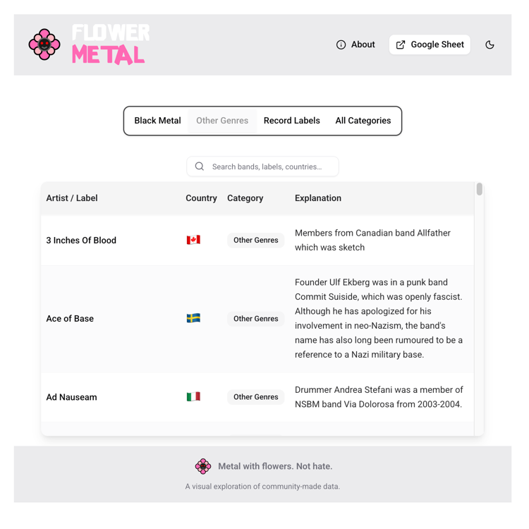

[![Personal Website][personal-website-shield]][personal-website-url]
[![Mail][personal-email-shield]](mailto:cyrilo.dev@gmail.com)
[![LinkedIn][linkedin-shield]][linkedin-url]
[![MIT License][license-shield]][license-url]

<br/>

<p align="center">
  
</p>

<h1 align="center">🌸 Flower Metal 🌸</h1>
<h3 align="center">Metal with flowers. Not hate.</h3>

<p align="center">
  A lightweight exploration of a community-made dataset on metal bands.
</p>

---

## Table of Contents

- [About the Project](#about-the-project)
- [Built With](#built-with)
- [Getting Started](#getting-started)
- [License](#license)
- [Contact](#contact)

---

## About the Project

Flower Metal is a small web project that visualizes a **community-curated dataset** listing metal bands and their perceived proximity to far-right, Nazi, or anti-fascist positions.

This site **does not verify or update the data** — it simply makes it easier to browse the dataset and form your own conclusions.

📄 You can view the original published spreadsheet here:

➡️ https://docs.google.com/spreadsheets/u/0/d/e/2PACX-1vSfnVZGsyxn5eEacXKJZk3-_ql3bQAkPqzdc8p3fCdxtPS9BtvNlj0yjskUQyy3eDYBL9yYTqbba_5q/pubhtml?pli=1

---

## Built With

- [Next.js](https://nextjs.org/)
- [React](https://reactjs.org/)
- [TypeScript](https://www.typescriptlang.org/)
- [Tailwind CSS](https://tailwindcss.com/)
- [shadcn/ui](https://ui.shadcn.com/)
- [Lucide Icons](https://lucide.dev/)

---

## Getting Started

### Prerequisites

- Node.js
- npm

### Installation

1. Clone the repository:

```bash
git clone https://github.com/Banaanas/flower-metal.git
